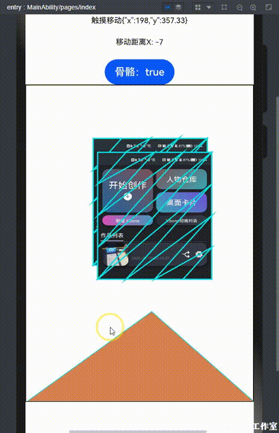

#### 一起手撸一个Canvas 2D骨骼动画
作者：九弓子

思索好久到底怎么写这篇分享，纠结的点在于这个时间点刚刚好ArkUI api8更新。
思来想去最后还是决定分享一些我个人的干货吧。

**从零手写2D骨骼动画原理Demo**

    这篇分享文章的内容最初的实现思路，来自于去年我在搜索相关内容的时候。
    看到了GiteeID：@kaysama 关于仿射矩阵的线代学习文章，受益匪浅特别感谢
    （我并不认识但还是感谢）

##### 什么是2D骨骼动画
  
  2D骨骼动画主要是为了解决2D平面游戏、动画制作中的一个古老的痛点。

      “跑步弯腿这个动作如果靠大量绘画来解决，是不是有点太费手了？”

  所以市面上从flash年代开始，就一直有着2D骨骼动画的解决方案。
  主要思路就是通过用户交互给需要变形的图像绑定一个抽象的“骨骼”。通过移动骨骼将图片变形。
  听起来好像不是很复杂，但目前来说并没有任何一个具体的图像编辑软件将该功能彻底开源。

  所以我在参加HarmonyOS应用创新大赛的时候，由于比赛时间过于漫长。
  便在我个人制作发布的XstoryMaker App中加入了Xbone 2D骨骼动画的功能。

  具体就是这个样子：
  

  制作这样的图形图像功能，其实并不一定非要用任何一个专属的计算机语言或者框架。
  关键的点在于图形的抽象切割与图像变换需要的矩阵运算。
  我们在开发HarmonyOS应用中，如果使用ArkUI来实现。
  那canvas组件大部分api都是w3c的标准，非常适合这样内容原生开发。

##### 1·开发准备
  永远不要接触比线上正式版版本更低的应用开发框架，所以我们首先需要。
  编辑器：DevEco Studio 3.0 Beta4
  新建项目：ArkTS api8版本 
  
  当你准备到这样，我们就开始吧。

##### 2·Canvas组件绘制一张图片
写入如下代码，会得到一张完全由canvas组件渲染的图片。

    @Entry
    @Component
    struct Index {
      private settings: RenderingContextSettings = new RenderingContextSettings(true)
      private ctx: CanvasRenderingContext2D = new CanvasRenderingContext2D(this.settings)
      build() {
        Row() {
          Column() {
            Canvas(this.ctx)
              .onReady(()=>{
                //渲染一张图片
                let img = new ImageBitmap("/common/img/test.jpg")
                this.ctx.drawImage(img,0,0,180,200)
              })
              .width("100%")
              .height(500)
              .border({width:1})
          }
          .width('100%')
        }
        .height('100%')
      }
    }

  我们使用了canvas的drawImage方法绘制图片。
  重要的点在于eTS中对图片的要求需要的是ImageBitmap对象，而是web或类web范式中的ImageData对象。
  为了方便后续内容开发，我们对绘制图片进行了尺寸的约束180*200，在eTS中这里的单位是vp。
  
      如果小伙伴你按这个尺寸放置图片发现变形了，可以对图片的真实px数据进行px2vp的转换。
      从而调整图片高度，来让图片变形恢复到正常。
      
  但这不是重点，重点是我们在canvas绘制图片，可以像平常image组件组件一样对其进行缩放与形变。
  因为这些数据已经全面进入代码管理，意味着我们可以通过代码为所欲为了。

##### 3·触控反馈
  当我们开发canvas项目，首先要实现一个基本的触控事件。才能让画布内容与用户交互可以顺利进行
  已知我们现在所有数据都精确到了xy坐标系中，那么通过初中数学我们得知。
  我们至少需要一个方便处理二维向量的数学库
  

      cd entry //可以不跳转这里 但是这样方便查看
      npm install victor
      npm install @types/victor //因为这个库已经很老旧了，需要ts声明包，好在有的~

  然后在我们的项目中继续书写代码如下

    import Victor from "victor"
    @Entry
    @Component
    struct Index {
      private settings: RenderingContextSettings = new RenderingContextSettings(true)
      private ctx: CanvasRenderingContext2D = new CanvasRenderingContext2D(this.settings)
      @State touchStart:{x:number,y:number} = { x:0,y:0 }
      @State touchMove:{x:number,y:number} = { x:0,y:0 }
      @State distance:number = 0
      build() {
        Row() {
          Column() {
            Column({space:20}){
              Text("触摸开始:"+JSON.stringify(this.touchStart)).fontSize(12)
              Text("触摸移动"+JSON.stringify(this.touchMove)).fontSize(12)
              Text("移动距离X: "+this.distance).fontSize(12)
            }
            Canvas(this.ctx)
              .onReady(()=>{
                //渲染一张图片
                let img = new ImageBitmap("/common/img/test.jpg")
                this.ctx.drawImage(img,0,0,180,200)
              })
              .onTouch((e)=>{
                //触摸开始
                if(e.type==0){
                  this.touchStart.x = parseFloat(e.touches[0].x.toFixed(2))
                  this.touchStart.y = parseFloat(e.touches[0].y.toFixed(2))
                }
                //触摸移动
                if(e.type==2){
                  this.touchMove.x = parseFloat(e.touches[0].x.toFixed(2))
                  this.touchMove.y = parseFloat(e.touches[0].y.toFixed(2))
                }
                //触摸结束
                if(e.type==1){
                  let point1 = new Victor(this.touchStart.x,this.touchStart.y)
                  let point2 = new Victor(this.touchMove.x,this.touchMove.y)
                  this.distance = point1.distanceX(point2)
                  this.touchStart = {x:0,y:0}
                  this.touchMove = {x:0,y:0}
                }
              })
              .width("100%")
              .height(500)
              .border({width:1})
          }
          .width('100%')
        }
        .height('100%')
      }
    }

  上面代码我们为页面中添加了触控的反馈事件onTouch，eTS的触摸事件与平常开发不同的是。
  Start Move End 的事件区分在callback的参数中，而不是事件本身。
  这大大方便了我们对数据获取方式的函数书写，我们很轻松通过三个 if 就获取到了需要绑定的坐标数据。
  并且利用victor库的利用，在触摸结束的callback中完成了触摸移动时X轴水平移动距离的运算。
  如下图：
  

##### 4·触控移动与画布重绘

  现在我们具备了图片渲染 + 二维向量运算 + 触控事件反馈，我们可以移动图片了。

      //build函数外新建一个函数
      moveImage(){
        let point1 = new Victor(this.touchStart.x,this.touchStart.y)
        let point2 = new Victor(this.touchMove.x,this.touchMove.y)

        // 计算触摸过程移动坐标 与 触摸开始坐标的向量差值 
        this.moved = point2.subtract(point1)
        // 向量相加获得图片应该出现新的点
        let new_pos = new Victor(this.img_pos.x,this.img_pos.y).add(this.moved)
        //重新绘制
        this.ctx.drawImage(this.img,new_pos.x,new_pos.y,180,200)
      }

  新的代码新建了上述函数，很明显该函数应该放置到触摸移动的反馈中。
  我们通过基础的运算便可以得到图片新的坐标，再次drawImage绘制即可。但这时候有一个问题，画面现在缺少重绘机制，于是会得到如下效果。
  

  所以我们需要在整个 moveImage 的过程最一开始的动作中添加一行代码

      this.ctx.clearRect(0,0,360,500) //全画布宽高clear清空

  最后我们尽量优化一下代码逻辑和一些必要的全局变量定义，书写新的代码

      import Victor from "victor"
      @Entry
      @Component
      struct Index {
        private settings: RenderingContextSettings = new RenderingContextSettings(true)
        private ctx: CanvasRenderingContext2D = new CanvasRenderingContext2D(this.settings)
        @State touchStart:{x:number,y:number} = { x:0,y:0 }
        @State touchMove:{x:number,y:number} = { x:0,y:0 }
        @State distance:number = 0
        private img:ImageBitmap = new ImageBitmap("/common/img/test.jpg")
        private img_pos:{x:number,y:number} = {x:0,y:0}
        private moved:Victor = new Victor(0,0)

        moveImage(){
          this.ctx.clearRect(0,0,360,500)
          let point1 = new Victor(this.touchStart.x,this.touchStart.y)
          let point2 = new Victor(this.touchMove.x,this.touchMove.y)
          this.moved = point2.subtract(point1)
          let new_pos = new Victor(this.img_pos.x,this.img_pos.y).add(this.moved)
          this.ctx.drawImage(this.img,new_pos.x,new_pos.y,180,200)
        }
        build() {
          Row() {
            Column() {
              Column({space:20}){
                Text("触摸开始:"+JSON.stringify(this.touchStart)).fontSize(12)
                Text("触摸移动"+JSON.stringify(this.touchMove)).fontSize(12)
                Text("移动距离X: "+this.distance).fontSize(12)
              }
              Canvas(this.ctx)
                .onReady(()=>{
                  //渲染一张图片
                  this.ctx.drawImage(this.img,this.img_pos.x,this.img_pos.y,180,200)
                })
                .onTouch((e)=>{
                  //触摸开始
                  if(e.type==0){
                    this.touchStart.x = parseFloat(e.touches[0].x.toFixed(2))
                    this.touchStart.y = parseFloat(e.touches[0].y.toFixed(2))
                  }
                  //触摸移动
                  if(e.type==2){
                    this.touchMove.x = parseFloat(e.touches[0].x.toFixed(2))
                    this.touchMove.y = parseFloat(e.touches[0].y.toFixed(2))
                    this.moveImage()
                  }
                  //触摸结束
                  if(e.type==1){
                    let point1 = new Victor(this.touchStart.x,this.touchStart.y)
                    let point2 = new Victor(this.touchMove.x,this.touchMove.y)
                    this.distance = point1.distanceX(point2)
                    this.img_pos.x += this.moved.x
                    this.img_pos.y += this.moved.y
                  }
                })
                .width("100%")
                .height(500)
                .border({width:1})
            }
            .width('100%')
          }
          .height('100%')
        }
      }

##### 5·顶点绘制与抽象切割
  
  **什么是顶点？**
  顶点是处理图形数据时候的一个抽象数据，通过初中数学我们得知一条线段中有无数个点。
  而我们做开发只能尽量绑定够多的点，让画面变得平滑。因为足够多的点才有足够多的面，而**点和面增多的代价就是性能**。
  

  **什么是切割？**
  切割的目的是为了让图形的渲染具备更多可编程的面，而我们屏幕光栅化之后得到的数据都是线段拼接的。这时候就可以利用我们初中的数学知识，得知一般常用的三角形阵列切割方式如下三种。
  

  很明显，我们为了更广泛的适配，可以选择第二种切割方式。
  其规律是：
  构建当前三角形的顶点的连接顺序依赖于要和前面已经出现过的2个顶点组成三角形的当前顶点的序号的奇偶性（如果从0开始）：
  如果当前顶点是奇数：
  组成三角形的顶点排列顺序：T = [n-1 n-2 n].
  如果当前顶点是偶数：
  组成三角形的顶点排列顺序：T = [n-2 n-1 n].

      //一个坐标点数组的简单算法
      pointToarr(pointList){
        let arr = [];
        let last_index = pointList.length - 1;
        let point_index = 1;
        //制作三角形阵列
        while (point_index <= last_index / 2) {
          let triangle1 = [point_index - 1, point_index, pointList.length - point_index];
          let triangle2 = [pointList.length - point_index, point_index, pointList.length - (point_index + 1)];
          arr.push(triangle1, triangle2);
          point_index = point_index + 1;
        }
        return arr;
      }

  **将切割作用于画面**
  为了更好的开发与用户交互，我们需要将上述的内容作用的画面上。那么会需要对各坐标点进行绘制并连线，并且利用canvas的 clip 方法将画面全部切割。

    drawTriangleGrid(pointList){
      //通过上述算法得到三角形阵列的位标矩阵
      let triangleList = this.pointToarr(pointList)
      //开始对三角形数据进行循环绘制并切割画布
      triangleList.forEach((triangle, tidx) => {
        this.ctx.save();
        this.ctx.beginPath();
        this.ctx.lineWidth = 2;
        this.ctx.strokeStyle = "#07DFDF";
        let temp_pointList = [];
        triangle.forEach((item) => {
          temp_pointList.push(item);
        });
        let transfrom_point = [
          this.pointList[temp_pointList[0]],
          this.pointList[temp_pointList[1]],
          this.pointList[temp_pointList[2]]
        ];
        this.ctx.moveTo(this.img_pos.x + transfrom_point[0].x, this.img_pos.y + transfrom_point[0].y);
        this.ctx.lineTo(this.img_pos.x + transfrom_point[1].x, this.img_pos.y + transfrom_point[1].y);
        this.ctx.lineTo(this.img_pos.x + transfrom_point[2].x, this.img_pos.y + transfrom_point[2].y);
        this.ctx.closePath();
        this.ctx.stroke();
        this.ctx.clip();
        this.ctx.drawImage(this.img, this.img_pos.x, this.img_pos.y, 180,200);
        this.ctx.restore()
      })
    }

然后我们得到如下效果：
     

##### 6·抽象骨骼与仿射矩阵

到这里我需要一个定点旋转的骨骼了。
我们连三角形网格都是通过假设抽象出来的了，那我们骨骼当然也是假装的。
为了让咱们的文章不至于特别冗长，这里抽象一个非常抽象的三角形即可。
比如这样：

**什么是抽象骨骼**
如下图中绿色和蓝色的三角形就是骨骼，连接它们之间的圆形我们可以理解为关节。
反正都是假装抽象的，怎么叫并不重要，重要的它们是三角形。
通过三角函数计算，我们可以得到**三角形定点旋转于二维坐标系的各点**。
从而计算出**旋转后与旋转前的仿射矩阵**，从而通过canvas的api对三角形阵列网格进行**仿射重绘**。

**什么是仿射矩阵**

在ArkUI中的Canvas组件遵循了ES标准接口，仿射矩阵的变换api为

    transform(
      scaleX: number, 
      skewX: number, 
      skewY: number, 
      scaleY: number, 
      translateX: number, 
      translateY: number): void

通过线代基础我们可以整理其数据为：

可推断，canvas中的transform使用的是初等列变换，使用列向量右乘变换矩阵。即：

假设有变化前的三点(x1,y1) (x2,y2) (x3,y3)和变化后的三点(x1',y1') (x2',y2') (x3',y3')，仿射矩阵T，则有

##### 7.引入齐次坐标完成运算

首先我们需要让我们这个**粗壮**的骨骼，能有两次不同的形状。
也就是移动我们预留的那个顶点，如下图这样：

然后将底部三角形三个点的数据，进行整理并参与矩阵运算

    let point1 = new Victor(0,500)
    let point2 = new Victor(360,500)
    //单独定义初始数据
    let old_t = [
      point1,point2,this.moveBonePoint_init
    ]
    //通过上图的移动触控，我们拿到第三个新的坐标
    let new_t = [
      point1,point2,this.moveBonePoint
    ]
    //开始获取仿射矩阵的运算
    let itemList = this.getTransformMatrix(old_t, new_t)

在详细介绍运算之前，我们同样需要一个数学库。

    npm install three
    npm install @types/three
    //安装three库，为的是利用其Matrix3进行3x3矩阵运算
    //头部需要引入
    import { Matrix3 } from 'three'
  

下方两个函数进行新的仿射矩阵获取

    getTransformMatrix(old_t, new_t) {
        let matrixFrom = null
        let matrixTo = null
        let matrixTransform = new Matrix3()
        let itemList = null
        //定义新的类型作为from
        matrixFrom = new Matrix3()
        matrixFrom.set(
          old_t[0].x,old_t[0].y,1,
          old_t[1].x,old_t[1].y,1,
          old_t[2].x,old_t[2].y,1
        )
        //定义新的类型作为To运算参数
        matrixTo = new Matrix3()
        matrixTo.set(
          new_t[0].x,new_t[0].y,1,
          new_t[1].x,new_t[1].y,1,
          new_t[2].x,new_t[2].y,1
        )
        matrixTransform = matrixTransform.multiplyMatrices(
        matrixFrom.invert(),
          matrixTo
        )
        if (matrixTransform == null) {
          return null
        }
        //最后得到的结果并不能直接使用，还需要一次行列式的整理
        itemList = this.getItemList(matrixTransform.elements, 3, 3)
        return itemList
      }

    //重新归位齐次坐标
    getItemList(numList, m, n) {
      if (!(m && n && m * n === numList.length)) {
        console.error('Matrix Error')
      }
      let i, j, itemList, subItemList
      itemList = new Array(m)
      for (i = 0; i < m; i++) {
        subItemList = new Array(n)
        for (j = 0; j < n; j++) {
          subItemList[j] = numList[j * m + i].toFixed(3)
        }
        itemList[i] = subItemList
      }
      return itemList
    }

在拿到新的仿射矩阵之后，我们直接到之前的 moveImage中对图片进行变换即可

      moveImage(){
        this.ctx.clearRect(0,0,360,500)
        let point1 = new Victor(this.touchStart.x,this.touchStart.y)
        let point2 = new Victor(this.touchMove.x,this.touchMove.y)
        this.moved = point2.subtract(point1)
        let new_pos = new Victor(this.img_pos.x,this.img_pos.y).add(this.moved)
        this.ctx.save()
        this.ctx.translate(new_pos.x,new_pos.y)
        this.ctx.save()
        console.log(JSON.stringify(this.transform))
        let itemList = JSON.parse(JSON.stringify(this.transform))
        this.ctx.transform(
        parseFloat(itemList[0]),
        parseFloat(itemList[1]),
        parseFloat(itemList[2]),
        parseFloat(itemList[3]),
        //这里下面两个参数固定，可以看到图片跟随底部三角形一起原地变形
        //如果跟着矩阵一起，将会位移
        parseFloat(itemList[4]),
        parseFloat(itemList[5]))
        this.ctx.drawImage(this.img,0,0,180,200)
        this.ctx.restore()
        this.ctx.restore()
      }

得到下图结果：

##### 8.权重完全体展示

从上面可以看到，其实之前我们对顶点切割并没有实际应用到运动中，那是因为在这个过程中还缺少了权重的绑定。

**什么是权重绑定**

如上图，对顶点进行规划之后。需要让顶点与需要移动的骨骼进行数据关联。
这样一根**骨骼去移动部分顶点**，还有**骨骼IK联动**，
就会达到我们最终需要的2D骨骼动画的效果啦！

##### 9.Xbone运行库开源地址

NPM社区包地址：

    npm install xbone

##### 10.Xbone动画制作教程

1.华为应用市场下载app：XstoryMaker 

教程查看文档：
HarmonyOS代码贡献库：
https://gitee.com/harmonyos/event/tree/digixActivity2022/xboneruntime

##### 11.最后的代码

通读上面的文档，再复制下面代码替换你自己的图片地址。
就可以看到截至到第7部分的内容，篇幅有限，下次有机会再分享2D骨骼动画相关的更多细节。
这个业务本身原理不难，复杂在于细节算法和要素过多。
除了上述的**权重绑定**之外，
还有基础的交互映射的**定点旋转**
PNG图片取值Uin8像素矩阵，对图像主体识别的**寻路算法**
**多骨骼IK关节旋转联动**
当这些都做完也只是一个简单实现，对于这些算法细节还应该引入更多的模型用AI试错切割，才能让用户的体验更好，网格分部更均匀，权重分配更顺滑。
哦，忘了···还有**动画轨道设计**以及**帧序列**和**缓动动画刷新**
目前进度就是上面app基本都实现的一些，开源库就是项目代码中专门整理出来分享大家一起交流的。
如果有小伙伴感兴趣，可以一起交流···

    import Victor from "victor"
    import { Matrix3 } from 'three'
    @Entry
    @Component
    struct Index {
      private settings: RenderingContextSettings = new RenderingContextSettings(true)
      private ctx: CanvasRenderingContext2D = new CanvasRenderingContext2D(this.settings)
      @State touchStart:{x:number,y:number} = { x:0,y:0 }
      @State touchMove:{x:number,y:number} = { x:0,y:0 }
      @State distance:number = 0
      @State boneMove:boolean = false
      @State moveBonePoint_init:Victor = new Victor(180,300)
      @State moveBonePoint:Victor = new Victor(180,300)
      @State transform:number[] = []
      private img:ImageBitmap = new ImageBitmap("/common/img/test.jpg")
      private img_pos:{x:number,y:number} = {x:0,y:0}
      private moved:Victor = new Victor(0,0)
      private pointList:Victor[] = [
        new Victor(0,0),
        new Victor(0,50),
        new Victor(0,100),
        new Victor(0,150),
        new Victor(0,200),
        new Victor(45,200),
        new Victor(90,200),
        new Victor(135,200),
        new Victor(180,200),
        new Victor(180,150),
        new Victor(180,100),
        new Victor(180,50),
        new Victor(180,0),
        new Victor(135,0),
        new Victor(90,0),
        new Victor(45,0)
      ]

      drawTriangleGrid(pointList){
        let triangleList = this.pointToarr(pointList)
        triangleList.forEach((triangle, tidx) => {
          this.ctx.beginPath();
          this.ctx.lineWidth = 2;
          this.ctx.strokeStyle = "#07DFDF";
          let temp_pointList = [];
          triangle.forEach((item) => {
            temp_pointList.push(item);
          });
          let transfrom_point = [
            this.pointList[temp_pointList[0]],
            this.pointList[temp_pointList[1]],
            this.pointList[temp_pointList[2]]
          ];
          this.ctx.moveTo(transfrom_point[0].x, transfrom_point[0].y);
          this.ctx.lineTo(transfrom_point[1].x, transfrom_point[1].y);
          this.ctx.lineTo(transfrom_point[2].x, transfrom_point[2].y);
          this.ctx.closePath();
          this.ctx.stroke();
        })
      }
      pointToarr(pointList){
        let arr = [];
        let last_index = pointList.length - 1;
        let point_index = 1;
        //制作三角形阵列
        while (point_index <= last_index / 2) {
          let triangle1 = [point_index - 1, point_index, pointList.length - point_index];
          let triangle2 = [pointList.length - point_index, point_index, pointList.length - (point_index + 1)];
          arr.push(triangle1, triangle2);
          point_index = point_index + 1;
        }
        return arr;
      }

      moveImage(){
        this.ctx.clearRect(0,0,360,500)
        let point1 = new Victor(this.touchStart.x,this.touchStart.y)
        let point2 = new Victor(this.touchMove.x,this.touchMove.y)
        this.moved = point2.subtract(point1)
        let new_pos = new Victor(this.img_pos.x,this.img_pos.y).add(this.moved)
        this.ctx.save()
        this.ctx.translate(new_pos.x,new_pos.y)
        this.ctx.save()
        console.log(JSON.stringify(this.transform))
        let itemList = JSON.parse(JSON.stringify(this.transform))
        this.ctx.transform(
        parseFloat(itemList[0]),
        parseFloat(itemList[1]),
        parseFloat(itemList[2]),
        parseFloat(itemList[3]),
        90,
        0)
        this.ctx.drawImage(this.img,0,0,180,200)
        this.ctx.restore()
        this.ctx.restore()
      }
      getTransformMatrix(old_t, new_t) {
        let matrixFrom = null
        let matrixTo = null
        let matrixTransform = new Matrix3()
        let itemList = null

        matrixFrom = new Matrix3()
        matrixFrom.set(
          old_t[0].x,old_t[0].y,1,
          old_t[1].x,old_t[1].y,1,
          old_t[2].x,old_t[2].y,1
        )
        matrixTo = new Matrix3()
        matrixTo.set(
          new_t[0].x,new_t[0].y,1,
          new_t[1].x,new_t[1].y,1,
          new_t[2].x,new_t[2].y,1
        )

        matrixTransform = matrixTransform.multiplyMatrices(
        matrixFrom.invert(),
          matrixTo
        )

        if (matrixTransform == null) {
          return null
        }
        itemList = this.getItemList(matrixTransform.elements, 3, 3)
        return itemList
      }
      getItemList(numList, m, n) {
        if (!(m && n && m * n === numList.length)) {
          console.error('Matrix Error')
        }
        let i, j, itemList, subItemList
        itemList = new Array(m)
        for (i = 0; i < m; i++) {
          subItemList = new Array(n)
          for (j = 0; j < n; j++) {
            subItemList[j] = numList[j * m + i].toFixed(2)
          }
          itemList[i] = subItemList
        }
        return itemList
      }
      drawBone(){
        this.ctx.save()
        this.ctx.beginPath();
        this.ctx.lineWidth = 2;
        this.ctx.strokeStyle = "#07DFDF";
        this.ctx.fillStyle = "#D88050"
        this.ctx.moveTo(0,500)
        this.ctx.lineTo(360,500)
        this.ctx.lineTo(this.moveBonePoint.x,this.moveBonePoint.y)
        this.ctx.closePath();
        this.ctx.stroke();
        this.ctx.fill()
        this.ctx.restore()

        let point1 = new Victor(0,500)
        let point2 = new Victor(360,500)
        let old_t = [
          point1,point2,this.moveBonePoint_init
        ]
        let new_t = [
          point1,point2,this.moveBonePoint
        ]
        let itemList = this.getTransformMatrix(old_t, new_t)

        this.transform = [
          itemList[0][0],
          itemList[0][1],
          itemList[1][0],
          itemList[1][1],
          itemList[2][0],
          itemList[2][1]
        ]
      }
      build() {
        Row() {
          Column() {
            Column({space:20}){
              Text("触摸开始:"+JSON.stringify(this.touchStart)).fontSize(12)
              Text("触摸移动"+JSON.stringify(this.touchMove)).fontSize(12)
              Text("移动距离X: "+this.distance).fontSize(12)
              Button("骨骼："+this.boneMove)
              .onClick(()=>{
                this.boneMove = !this.boneMove
                if(this.boneMove){
                  this.drawBone()
                }
              })
            }
            Canvas(this.ctx)
              .onReady(()=>{
                //渲染一张图片
    //            this.ctx.drawImage(this.img,this.img_pos.x,this.img_pos.y,180,200)
                //渲染一个三角形阵列切割后的图片
    //            this.drawTriangleGrid(this.pointList)
                this.moveImage
              })
              .onTouch((e)=>{
                //触摸开始
                if(e.type==0){
                  this.touchStart.x = parseFloat(e.touches[0].x.toFixed(2))
                  this.touchStart.y = parseFloat(e.touches[0].y.toFixed(2))
                }
                //触摸移动
                if(e.type==2){
                  this.touchMove.x = parseFloat(e.touches[0].x.toFixed(2))
                  this.touchMove.y = parseFloat(e.touches[0].y.toFixed(2))
                  this.moveImage()
    //              this.drawTriangleGrid(this.pointList)
                  if(this.boneMove){
                    this.moveBonePoint.x = this.touchMove.x
                    this.moveBonePoint.y = this.touchMove.y
                    this.drawBone()
                  }
                }
                //触摸结束
                if(e.type==1){
                  let point1 = new Victor(this.touchStart.x,this.touchStart.y)
                  let point2 = new Victor(this.touchMove.x,this.touchMove.y)
                  this.distance = point1.distanceX(point2)
                  this.img_pos.x += this.moved.x
                  this.img_pos.y += this.moved.y
                }
              })
              .width("100%")
              .height(500)
              .border({width:1})
          }
          .width('100%')
        }
        .height('100%')
      }
    }

